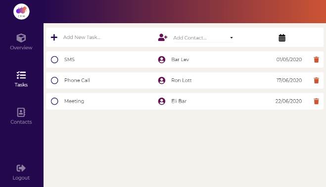

## CRM SYSTEM - Customer Relationship Management 

https://crm-system-cloud.herokuapp.com 

Customer Relationship Management (CRM) is a technology for managing a company's interaction with current and potential customers.

#### Login page screenshot

#### Insights - Overview page screenshot

#### Contacts page screenshot

#### Popup screenshot

#### Tasks page screenshot

### Front -  Built With:

https://github.com/hadarAlonCode/crm_system_client

- React
- Redux
- Sass

### Back - Built With:

https://github.com/hadarAlonCode/crm_system_server

- Node.JS
- Express
- MongoDB

### features:

- User Authentication - Each user has his own information.
- Saving login information with cookie.
- Create & Update & Delete Contacts.
- Search Contact.
- Tasks Tracking - Manage Tasks List With Option to add client and date.
- Insights Page - built with Recharts & DatePicker Packeges.
- Responsive Design.

### login:

You can currently log in to the site with the demo account 
*The option to add new user will be added later